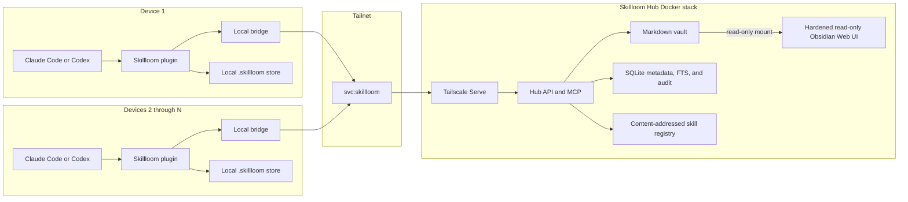
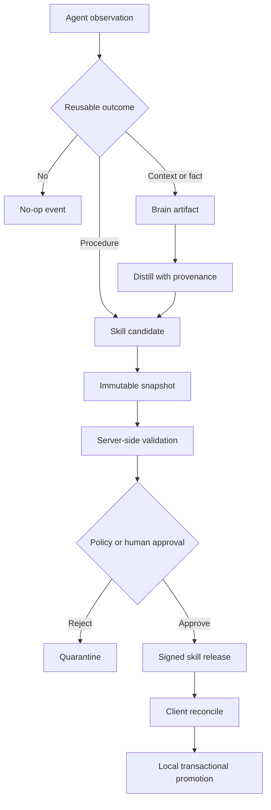

# Skillloom Hub Architecture

- Status: Proposed
- Date: 2026-07-21
- Scope: Shared knowledge and Agent Skills across devices in one tailnet

## Decision

Skillloom remains one installable plugin and CLI. An optional Skillloom Hub runs as a Docker service inside the user's tailnet.

After the Hub has been bootstrapped once, installing Skillloom on any additional device in the same tailnet requires no Hub URL, shared secret, filesystem mount, or per-device registration. The installed client discovers the Hub through a conventional Tailscale Service, authenticates with Tailscale identity, pulls approved skill releases, and exposes the shared brain through the bundled MCP bridge.

The Hub contains two related but separate domains:

- Brain: mutable notes, facts, decisions, research, memories, sources, and attachments.
- Skill registry: immutable, validated, versioned Agent Skill releases.

A brain artifact never becomes executable agent instruction without passing through the existing Skillloom candidate, validation, policy, and promotion lifecycle.

## Product contract

### One-time Hub bootstrap

One tailnet administrator performs a single bootstrap:

1. Start the Skillloom Hub Docker stack on an always-on device.
2. Define and approve the Tailscale Service `svc:skillloom` on TCP 443.
3. Persist the Hub data volume, Tailscale state, release-signing key, and backup configuration.
4. Grant the intended tailnet users or tagged devices Skillloom application capabilities.

Tailscale requires a Service to be defined and its host advertisement approved. Skillloom must not claim that first-time Hub creation is zero-touch.

Zero-configuration client discovery requires MagicDNS and Tailscale 1.94 or newer on the participating devices. Older Linux clients may require `accept-routes`, which would violate the client experience promised by this design.

### Installation contract

"Install Skillloom" means installing the CLI and plugin together through one setup flow. Copying only the plugin directory cannot satisfy the guarantee because the bundled MCP configuration depends on the local bridge and initial release reconciliation.

The intended entry point is:

```text
npx @chulinxz/skillloom setup --target auto --hub auto
```

The final command name is an implementation detail, but the setup contract is not. It must:

- install or verify the Skillloom CLI
- install the plugin for every detected supported harness
- obtain any required plugin or hook trust confirmation
- discover the Hub without asking for its address
- reconcile current releases before reporting success
- verify brain read access
- report the Hub and Obsidian MagicDNS URLs and their external and internal ports

Zero configuration does not mean zero consent. Tailscale login, Service approval, plugin trust, and write or promotion grants remain explicit security decisions.

### Client installation

For devices 2 through N, the expected experience is:

```text
install Skillloom
start Claude Code or Codex
use shared brain and approved skills
```

The client must not ask for:

- Hub address
- API token
- vault path
- database credentials
- Tailscale API key

The device must already be signed into the same tailnet and allowed to reach `svc:skillloom`.

### Offline behavior

If the Hub is unavailable:

- Installed skills continue to work locally.
- Local capture, validation, promotion, and rollback continue to use the local `.skillloom/` store.
- Cached release metadata remains readable.
- Shared brain search and writes report that the Hub is unavailable.
- Pending uploads remain durable and retry with the same idempotency key.

### Automation presets and host capability

The public mode remains one of three presets. The client resolves each preset into four inspectable dimensions without changing stored v1 configuration:

| Preset | Review trigger | Brain capture | Retrieval | Skill promotion |
| --- | --- | --- | --- | --- |
| `manual` | `manual` | `manual` | `explicit` | `manual` |
| `policy` | `manual` | `manual` | `explicit` | `policy` |
| `hermes` | `task-end` | `auto-curated` | `auto-bounded` | `policy` |

These values express requested behavior, not a claim that every host exposes the same lifecycle events. Claude Code can provide automatic SessionStart recall and Stop curation through the packaged hooks. Codex and any other host without compatible plugin lifecycle hooks retain the same MCP, Brain, candidate, and promotion surfaces, but their Hermes `hostLifecycle` is reported as `invoked` instead of `automatic`; the workflow must be invoked by the user or host.

The Hub does not run semantic learning decisions. The host agent decides whether an outcome is a no-op, declarative knowledge, or a procedural skill candidate. Authenticated Hub tools own durable Brain mutation, while deterministic Skillloom validation and policy own executable promotion.

## System topology



## Components

### Skillloom plugin

The existing plugin remains the single user-facing installation unit. It bundles:

- Existing capture, validation, promotion, recovery, and rollback skills.
- A brain workflow skill for search, read, capture, and curation.
- A dispatcher skill for discovering approved remote skill releases.
- MCP configuration that starts the local Skillloom bridge over stdio.
- Session hooks that reconcile releases and report degraded connectivity.

The plugin's explicit setup skill may start Docker after consent. It never mutates tailnet policy or creates credentials; it writes a reviewable policy file and stops at the admin-controlled approval boundary.

### Local bridge

The plugin MCP configuration starts:

```text
skillloom bridge --stdio
```

The bridge exists because a static plugin manifest cannot safely hardcode a tailnet-specific FQDN. It owns:

- Hub discovery
- protocol negotiation
- local cache
- request-level idempotent replay and local operation checkpoints
- release signature verification
- MCP tool forwarding
- durable pending writes
- offline error behavior

It does not own candidate validation or local installation transactions. Those remain in the existing Skillloom services.

### Skillloom Hub

The Hub is the only networked control plane. It owns:

- Brain reads, writes, indexing, and revision checks
- Agent identity and authorization
- Global provenance and append-only audit events
- Immutable candidate uploads and release artifacts
- Server-side revalidation before publication
- Release channels and event cursors
- Idempotency and conflict responses

The Hub backend listens only on loopback in the Tailscale network namespace. Tailscale Serve is the only network entry point.

### Obsidian

Obsidian is an optional human browsing surface, not the authorization or skill-promotion boundary. The current Hub release hosts a hardened browser desktop through the separate `svc:skillloom-obsidian` Tailscale Service.

- The Markdown vault remains Obsidian-compatible.
- The live Markdown vault is mounted read-only into Obsidian.
- Browser access uses Tailnet HTTPS port `443`; Tailscale Serve proxies to internal HTTP port `3000`.
- Terminal, sudo, desktop sharing, Funnel, and public container ports stay disabled.
- A future external-revision adapter may enable audited authoring and native Obsidian clients.
- Direct SMB, NFS, SSHFS, or Taildrive writes to the live vault are not supported.
- The planned adapter must detect Obsidian changes as external revisions and index them with provenance before native authoring is supported.

## Discovery

The bridge resolves the Hub in this order:

1. `SKILLLOOM_HUB_URL`, for development and recovery only.
2. A previously verified endpoint in the local client state.
3. The conventional Tailscale Service `skillloom` under the current tailnet's MagicDNS suffix.
4. The conventional single-host fallback `skillloom-hub` under the MagicDNS suffix.
5. Local-only degraded mode.

The bridge obtains the MagicDNS suffix from local Tailscale status. It never enumerates the tailnet through the administration API and never requires a Tailscale API key.

Cached discovery includes the Tailscale Service name, Hub instance ID, protocol version, and pinned release-signing public key. A changed Hub instance ID or signing key requires explicit re-trust.

## Identity and authorization

Tailscale provides transport identity. Skillloom enforces application authorization.

Tailscale Serve must:

- terminate tailnet HTTPS
- remove spoofed Tailscale identity and capability headers
- forward only configured application capabilities
- proxy only to the loopback Hub backend
- never enable Funnel for the Hub

The Hub supports four roles:

| Role | Brain | Skills |
| --- | --- | --- |
| Reader | Search and read | List and fetch releases |
| Contributor | Reader plus inbox capture and revision-checked edits | Propose candidates |
| Promoter | Contributor | Review and publish releases allowed by policy |
| Admin | Manage retention, roles, recovery, and keys | Manage channels and trust policy |

User-owned devices may be identified by Tailscale user headers. Tagged or unattended agent devices use Tailscale application capabilities. The production capability namespace must use a domain controlled by the Skillloom publisher or deployer.

Being in the same tailnet is necessary but not sufficient for write or promotion access.

## Storage boundaries

### Local store

Every device keeps its own `.skillloom/` store. Stores are never shared over a network filesystem.

The local store remains responsible for:

- local candidates
- local operations and locks
- staging and compensation
- installed destination backups
- local journal
- cached Hub state and pending transfers

Existing PID and owner-token locks remain local-process locks. They are not treated as distributed locks.

### Brain store

The Hub stores brain content as Markdown and attachments. SQLite stores derived and transactional state:

- stable artifact IDs
- path and content hash
- revision number
- type and sensitivity
- provenance
- FTS index
- idempotency records
- audit events

Markdown is the content source of truth. SQLite is rebuilt from files plus the durable audit log when necessary.

### Skill registry

Skill packages are stored separately as content-addressed immutable blobs. A release points to a verified package hash and never to a mutable vault path.

The registry persists:

- candidate snapshot
- validation report
- trust findings
- declared capabilities
- provenance references
- channel and semantic version
- release signature
- supersession state

## Artifact model

### Brain artifact

```text
id
type: note | fact | decision | source | project | memory
path
revision
contentHash
title
frontmatter
provenance
sensitivity
createdAt / createdBy
updatedAt / updatedBy
```

Brain artifacts are mutable through revision-checked writes.

### Skill release

```text
name
version
packageHash
sourceCandidateId
sourceArtifactIds[]
capabilities[]
validationDigest
channel
signature
createdAt / createdBy
```

Skill releases are immutable. Corrections create a new release.

### Hub event

```text
sequence
eventId
kind
actor
resource
requestId
payloadHash
createdAt
```

The monotonic sequence is the client synchronization cursor. Request IDs provide idempotency across retries.

## Knowledge and skill lifecycle



Remote brain content is always treated as data. Only a signed release that passed Skillloom validation is treated as executable agent instruction.

In Hermes, automatic curation follows a search-before-write contract:

1. Record a bounded local `memory` observation.
2. Search the Brain for an existing durable record before mutation.
3. Perform at most one successful central mutation: revision-checked update, typed link, or idempotent inbox capture.
4. Exclude raw transcripts, credentials, speculative claims, raw tool output, model context, and prompt-injection instructions.
5. Report a central write only after the authenticated Hub mutation succeeds.

If the Hub is unavailable, the local observation may record an attempt or fallback, but it cannot claim that shared curation succeeded. Work continues with local state and any durable pending mutation keeps its idempotency key. A procedural outcome remains an immutable candidate until validation and policy approve it; policy rejection preserves quarantine rather than silently installing or discarding the candidate.

## Client synchronization

### Initial install

Before installation reports success, the installer:

1. Verifies the local Tailscale client and tailnet connectivity.
2. Discovers `svc:skillloom`.
3. Negotiates the Hub protocol version.
4. Pins the Hub instance and release-signing public key.
5. Pulls the authorized release manifest.
6. Downloads missing packages into staging.
7. Verifies package hashes and signatures.
8. Promotes allowed releases through the existing local transaction path.
9. Installs or enables the plugin for the selected harnesses.
10. Runs a read-only brain query and local skill status check.

Installation fails clearly if the user requested Hub mode and the Hub cannot be verified. It may continue in local-only mode only when the user explicitly selects that mode.

### Subsequent sessions

At session start, the bridge performs a bounded reconcile using the last Hub event sequence. It downloads only changed manifests and missing blobs.

On a lifecycle-capable host in `hermes` mode, SessionStart also asks the host agent to make one bounded relevance search and read only a small number of high-confidence Brain results before substantial work. Hub unavailability degrades recall and the task continues without fabricated context. This semantic recall request belongs to the plugin hook; the bridge remains the MCP transport and does not inject unbounded Brain content itself.

New remote workflows are available immediately through the bundled dispatcher and MCP tools. Native filesystem skill discovery may require the next agent session after a local promotion. The plugin must report this distinction instead of claiming hot reload.

### Concurrent skill patches

Every skill patch includes the base release hash.

- If the base matches the current release, validation continues.
- If the base differs, the Hub records a divergent candidate.
- The Hub never resolves skill divergence with last-write-wins.
- A promoter rebases or supersedes the candidate explicitly.

### Concurrent note edits

Brain updates include `baseRevision` and `requestId`.

- Matching revision: write to staging, fsync, atomic rename, append event, commit metadata.
- Replayed request ID: return the original result.
- Changed revision: return a conflict with both revision IDs.
- Interrupted write: recover or discard staging on restart without exposing partial content.

Agent writes default to an inbox namespace. Direct edits to curated notes require Contributor capability and an explicit base revision.

## MCP surface

Initial tools:

| Tool | Default capability | Purpose |
| --- | --- | --- |
| `brain_search` | Reader | Search titles, content, type, and provenance |
| `brain_read` | Reader | Read one artifact and its revision metadata |
| `brain_capture` | Contributor | Create an idempotent inbox artifact |
| `brain_update` | Contributor | Revision-checked update |
| `brain_link` | Contributor | Add typed relationships without rewriting content |
| `skill_releases` | Reader | List signed, stable-approved releases visible to the caller |
| `skill_read` | Reader | Read one signed, stable-approved release and its validation evidence |
| `skill_propose` | Contributor | Upload an immutable candidate snapshot |
| `skill_publish` | Promoter | Publish a validated candidate allowed by policy |

Destructive deletion is not part of the initial MCP surface. Archival and retention remain administrative operations.

## Protocol contract

The bridge and Hub negotiate:

```text
protocolVersion
minimumClientVersion
hubInstanceId
tailnetIdentity
grantedCapabilities
releaseSigningPublicKey
latestEventSequence
```

Rules:

- Additive fields are backward-compatible.
- Removed or reinterpreted fields require a protocol major version.
- Clients reject a Hub requiring a newer incompatible major version.
- Mutations support request-level idempotent replay by operation ID and idempotency key in v1.
- Downloads verify content hashes. Byte-range transfer is deferred until package sizes require partial download recovery.
- All mutations require an idempotency key.

## Release channels

The first release supports:

- `stable`: eligible for automatic client reconciliation when local policy passes.

Review and quarantine channels are deferred for v1. The implemented v1 reader and reconciliation path exposes signed `stable` releases only; non-stable retention requires a later protocol revision and must not be claimed by the current MCP or HTTP reader surface.

A client may narrow automatic installation but may not broaden permissions granted by the Hub or its local policy. Effective permission is the intersection of Hub authorization, release policy, and local policy.

## Security invariants

- No public Hub endpoint or Tailscale Funnel.
- No shared vault or `.skillloom` network mount.
- No trust based only on source IP or a caller-supplied header.
- No brain artifact executes as instruction without promotion.
- No candidate is published without server-side validation of the uploaded snapshot.
- No release is installed without hash and signature verification.
- No automatic promotion expands declared capabilities beyond local policy.
- No secret, full transcript, or raw credential is stored as learning evidence.
- No direct backend listener is reachable outside the Tailscale network namespace.
- A changed Hub identity or signing key stops reconciliation until manually trusted.

## Failure recovery

| Failure | Required behavior |
| --- | --- |
| Hub unreachable | Local skills work; pending writes remain queued |
| Client exits during download | Retry the request, verify the content hash, and materialize atomically; byte-range transfer is deferred until package sizes require partial download recovery |
| Client exits during promotion | Existing local recovery and compensation apply |
| Hub exits during upload | Replay the request with the same idempotency key; recover or expire unreferenced staging without byte-range continuation |
| Hub exits during brain write | Recover staged write or preserve prior revision |
| Obsidian changes a file concurrently | Detect revision mismatch and create a conflict result |
| Duplicate request | Return the recorded idempotent result |
| Signing key changes | Stop and require explicit re-trust |
| Two candidates patch one release | Preserve both; require rebase or supersession |
| Index corruption | Rebuild from Markdown, registry metadata, and audit events |

## Deployment layout

```text
skillloom-hub/
  compose.yaml
  config/
    serve.json
    hub.json
  data/
    vault/
    registry/
    sqlite/
    staging/
    backups/
    keys/
    tailscale/
```

The Tailscale and Hub containers share a network namespace. The Hub binds to loopback. Persistent paths use explicit volumes and are included in backup and restore tests.

## Delivery phases

### Phase 1: Shared brain

- Hub bootstrap and discovery
- Tailscale identity and Reader/Contributor authorization
- Local MCP bridge
- Brain search, read, and inbox capture
- SQLite FTS index and audit events
- Offline cache and idempotent pending writes

### Phase 2: Shared skill registry

- Immutable candidate upload
- Server-side validation
- Signed stable channel
- Client reconcile and local transactional promotion
- Divergent patch handling

### Phase 3: Obsidian and operations

- Hardened read-only Obsidian Web UI through a separate Tailscale Service
- Optional audited Obsidian authoring adapter and external revision watcher remain future work
- Snapshot backup and restore drill
- Hub migration while preserving Service name and signing key
- Multiple Hub backends only after storage and leadership semantics are defined

## Acceptance criteria

Deterministic CI semantic E2E proves protocol, storage, authorization decisions, reconciliation, restart recovery, and local install transactions without a real tailnet. It is necessary but not sufficient for deployment proof.

Live deployment acceptance is a separate gated operator-run workflow. Its server phase runs on the Hub Docker host; contributor and restricted actor phases run from independent tailnet clients without Docker; only aggregation of all three matching redacted records may pass. Missing remote evidence exits incomplete. This live run was unavailable in the implementation environment, so operator-produced aggregate evidence remains required.

The design is considered implemented only when:

- A Hub is bootstrapped once and advertised as `svc:skillloom`.
- The same host advertises `svc:skillloom-obsidian`; its Brain mount is read-only and reachable only through Tailnet HTTPS port `443`.
- Two clean devices in the same tailnet install Skillloom without entering Hub configuration.
- Both devices discover the same Hub and receive the correct Tailscale-derived `grantedCapabilities`.
- A note captured on device A is searchable from device B.
- A stable skill release created from device A is verified and promoted on device B.
- An unauthorized or Reader-only device cannot write or publish.
- A concurrent note update returns a deterministic conflict without data loss.
- Divergent skill patches are preserved without last-write-wins.
- Device B continues using installed skills while the Hub is offline.
- Interrupted mutations replay safely by operation ID and idempotency key, downloads restart with content-hash verification, and local promotion resumes from durable checkpoints. Byte-range transfer remains deferred.
- A changed signing key stops automatic reconciliation.
- No Hub port is reachable outside the tailnet.

## Explicitly deferred

- Cloud agents that do not run inside the user's tailnet
- Peer-to-peer leader election with no designated Hub
- Multiple active writers to the same Hub data volume
- Semantic vector search requiring a hosted embedding provider
- Automatic conversion of arbitrary notes into skills
- Public multi-tenant hosting
- Browser Obsidian as the primary agent interface
