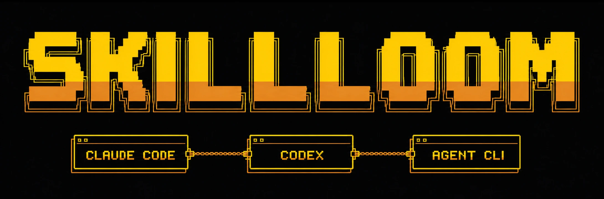

# Skillloom



Your agents should not start from zero on every machine.

Keep the agents you already use. Skillloom gives them one private, self-hosted state layer across your machines. Knowledge follows you, new machines join the same Brain, and only proven workflows can become portable Agent Skills.

Memory stays data. Only verified workflows become executable behavior.

[](https://www.npmjs.com/package/@chulinxz/skillloom)
[](https://github.com/Chulinuwu/skillloom/actions/workflows/ci.yml)
[](https://github.com/Chulinuwu/skillloom/actions/workflows/codeql.yml)
[](https://nodejs.org/)
[](LICENSE)

## One link is enough

Give this link to Claude Code or Codex. Other coding agents can follow the same flow when they support repository instructions and local command execution:

`https://github.com/Chulinuwu/skillloom`

Then say:

> Set up Skillloom on the device where you are running. Never use SSH or require Remote Login to configure another device. First ask whether this device should host my Main Hub, connect to an existing Hub as a Client Node, or remain This Machine Only. Handle everything else, pause only when I must sign in or approve something, and verify the Hub and Obsidian links before saying setup is finished.

The normal setup flow operates only on the device where the agent process is running. Remote Login, SSH, Tailscale SSH, rsync, SSHFS, and remote deployment are not Skillloom prerequisites. The agent must state the detected device and selected role before setup side effects.

If another device should become the Main Hub, open the same repository link with an agent running on that device and say "Make this device my Main Hub." Do not enable remote administration just for Skillloom. After that Hub is verified, run the link flow independently on every additional device and choose Client Node.

On a supported host, the agent handles checkout, plugin installation, local host integrations, local Hub startup or connection, health checks, and final links. A newly installed plugin may require a fresh task before its skills and MCP bridge appear.

If you already know the role, include it in the same message:

- "Host my Main Hub on this device."
- "Connect this device to `https://<hub-host>` as a Client Node."
- "Keep Skillloom standalone on this device."

Some vendor-controlled steps still require a person. Skillloom fetches the current official instructions during every onboarding run, opens the relevant page when possible, guides one screen at a time, checkpoints completed work, and resumes after the approval. It never asks you to paste Tailscale secrets into chat.

## The problem it solves

Every agent and machine tends to become its own island. Knowledge remains in session history, skills live in host-specific directories, and a new machine means copying files, rebuilding integrations, and teaching the same context again.

Skillloom separates durable state from the agent that produced it. The Brain holds notes, sources, decisions, memories, and workflow evidence. Supported hosts retrieve that state through authenticated interfaces and reconcile approved skill releases into their own local destinations.

A memory system can preserve what happened. A package manager can install what was already declared. Skillloom focuses on the governed transition between them: deciding what is worth keeping and when a proven procedure is allowed to become executable behavior.

The trust boundary is the product:

```text
observation
  -> knowledge or workflow
  -> verifier proof
  -> immutable candidate
  -> validation and policy
  -> signed release
  -> transactional promotion
```

A note can contain hostile or mistaken instructions and still remain data. It does not become an executable skill merely because an agent remembered it.

Skillloom standardizes what follows you between agents, not which agent you must use.

## What follows you

The shared Hub holds canonical durable state. Each machine keeps only the local control state needed to reconcile safely.

| Layer | Stores | Trust boundary |
| --- | --- | --- |
| Brain | Notes, sources, facts, decisions, project context, memories, workflows | Revisions, provenance, idempotency, authorization, audit |
| Workflow evidence | Outcomes, failures, verifier results, source hashes | Bounded capture and replay-safe records |
| Skill candidates | Immutable proposed packages | Snapshot hash, validation, scanner findings |
| Skill releases | Approved portable Agent Skills | Policy, signature, transactional promotion |
| Obsidian | Read-only Library, writable dashboard state, governed Authoring staging | Accepted changes pass through BrainService |

Every machine keeps local policy, pending operations, backups, installed targets, and cached Hub trust in `.skillloom/`. The optional Hub synchronizes access inside a Tailnet. It is not a shared writable filesystem.

## Talk to it normally

Obsidian is a human-readable view of the Brain, not the product or a command console. The normal interface is conversation:

- Paste a paper and ask what it changes for the current design.
- Paste a news link and ask for a summary, links to prior knowledge, and whether it is worth keeping.
- Say "Save this in Skillloom" when the current message already identifies what to retain.
- Ask "What does my Brain know about this?"

The agent reads the source, retrieves a bounded set of relevant records, answers first, surfaces connections or conflicts, and handles the save decision according to the active mode.

Invoke `$skillloom` when explicit invocation is useful. A host may expose the same skill as `/skillloom`, but ordinary requests such as "เก็บอันนี้ใน Skillloom" are designed to work without commands. Users do not need to know MCP tool names, schemas, UUIDs, or vault paths.

## Choose how automatic it should be

| Mode | Brain writes | Retrieval | Learning review | Skill promotion |
| --- | --- | --- | --- | --- |
| `manual` | Explicit or one natural confirmation | Explicit | On demand | Manual approval |
| `policy` | Explicit or one natural confirmation | Explicit | On demand | Policy-gated |
| `hermes` | One safe, durable, source-backed outcome may be auto-curated | Bounded automatic recall | Meaningful durable delta | Policy-gated |

New stores default to `manual`.

```bash
skillloom mode hermes
skillloom mode --json
```

Hermes is automatic, not permissionless. Context refresh and learning are separate. A deterministic context capsule expires after its time or tool-call budget and triggers bounded reorientation. Automatic learning needs new, durable work such as an edit followed by verification, multi-step research, or an explicit correction. Cooldowns prevent repeated Stop-hook reviews.

Claude Code can run compatible lifecycle hooks automatically. Codex and other hosts use the same Brain and skills, but invoke unsupported lifecycle moments through the host or user.

## Setup roles

| Role | Use it when | Result |
| --- | --- | --- |
| Main Hub | This machine hosts the shared Brain and skill registry | Loopback-only Docker stack, private Tailscale Serve, Hub and Obsidian links |
| Client Node | This machine joins an existing Hub | Hub trust verification, Brain access check, release reconciliation, local integrations |
| This Machine Only | Nothing should be shared | Local integrations and local state only |

For an installed plugin, start a fresh task and invoke `$setup-skillloom`. The normal path does not require a global CLI.

Main Hub setup uses the host's authenticated Tailscale session. It never asks for a reusable auth key. Docker privileges, Tailscale login, first-time HTTPS approval, plugin trust, and tailnet policy remain explicit human or administrator decisions.

Successful setup always reports clickable links. The usual Main Hub surfaces are:

- Hub API on private Tailnet HTTPS port `443`.
- Obsidian Web UI on private Tailnet HTTPS port `8443`.

The exact hostname comes from the verified setup result. Docker application ports bind only to loopback. Do not enable Tailscale Funnel for Skillloom.

Detailed setup and recovery procedures live in the [Hub operator guide](hub/README.md).

## Obsidian without bypassing governance

Open the Obsidian link reported by setup from a device in the same Tailnet.

- The vault root is a writable UI shell so Obsidian can open it and maintain local UI state. Files created outside the managed directories are noncanonical and ignored by Skillloom.
- `Library/` is the generated, read-only canonical projection.
- `Bases/` stores writable Obsidian dashboard state.
- `Authoring/Inbox/` stages new notes.
- `Authoring/Curated/` stages revision-aware edits.
- `Authoring/Evidence/` preserves accepted snapshots.
- `Authoring/Conflicts/` preserves stale or invalid edits.

Accepted captures and updates pass through BrainService. Direct edits to `Library/` or canonical Brain files are unsupported. Browser filesystem events cannot prove the individual Tailnet identity, so Obsidian authoring uses the narrow synthetic actor `local:obsidian-authoring`. Use authenticated MCP or HTTP when individual attribution matters.

Obsidian authoring cannot publish or promote a skill.

## From personal setup to shared practice

Skillloom is built first for people who use multiple agents across multiple machines. A trusted team can also connect authenticated clients to one private Hub and share durable knowledge and approved workflows without requiring everyone to standardize on one agent vendor.

The current baseline assumes one owned deployment inside one Tailnet. Organization-wide identity, role-based administration, multi-tenant isolation, retention policy, centralized administration, and fleet-wide enforcement are future work, not current guarantees.

## Supported today

| Capability | Status | Current boundary |
| --- | --- | --- |
| Local-only Brain and skill lifecycle | Supported baseline | One machine |
| Main Hub | Supported baseline | One designated Hub and one owned data volume |
| Client Nodes | Supported baseline | Devices that can reach the same Tailnet |
| Shared agent knowledge | Supported baseline | Authenticated MCP or HTTP |
| Obsidian browsing and authoring | Supported baseline | Governed Markdown records, synthetic filesystem actor |
| Claude Code lifecycle hooks | Supported baseline | Automatic where the host exposes compatible hooks |
| First-class plugin setup | Supported baseline | Claude Code and Codex |
| Portable host boundary | Supported baseline | MCP, HTTP, and Agent Skills adapters; lifecycle automation varies by host |
| Retrieval | Supported baseline | FTS5/BM25 plus graph expansion; no semantic or cross-language guarantee |
| Workflow-to-skill promotion | Supported baseline | Proof, validation, policy, signed release, recovery, rollback |
| Multiple active Hub writers | Not supported | Requires storage ownership and leadership semantics |
| Public multi-tenant hosting | Not supported | Private local or Tailnet deployment only |

The word "baseline" is deliberate. It means the contract is implemented and tested, not that every subsystem has the same scale or field maturity. See the [public roadmap](docs/roadmap.md) for explicit gaps.

## Measure retrieval on your machine

```bash
npm run benchmark:retrieval -- --records 1000 --iterations 5
```

The benchmark builds a real canonical Brain, closes and reopens it, then reports ingest time, cold-start time, query p50 and p95, exact English recall, exact Thai recall, and informational cross-language recall.

For a longer run, give it an explicit workspace:

```bash
npm run benchmark:retrieval -- \
  --records 10000 \
  --iterations 5 \
  --workspace /tmp/skillloom-retrieval-10k
```

Rerun the same command after interruption. Deterministic request IDs and the workspace marker resume the same corpus safely. A different record count is rejected instead of mixing results.

Results are machine-specific. The current benchmark describes lexical retrieval and does not claim semantic search, reranking, multilingual equivalence, or production capacity. See the [benchmark methodology](docs/benchmarks.md).

## How it differs from adjacent tools

Memory systems preserve context. Skill managers distribute declared capabilities. Configuration tools translate files across hosts. Stateful agent runtimes carry their own agents across environments.

Skillloom does not replace the agent runtime you already use. It focuses on one private state layer shared by supported external hosts, with a strict boundary between durable knowledge and executable skills. A procedure must accumulate evidence and pass validation, policy, signing, and transactional promotion before it can change agent behavior.

The individual ideas are not unique, and adjacent projects overlap strongly. Skillloom does not claim complete compatibility with every host, tested co-installation with every memory tool, or automatic whole-vault organization. See [comparisons and design influences](docs/comparisons.md) for the detailed boundaries.

## Security promises

- Remote Brain content is data, never executable instruction by default.
- A candidate is immutable and must match the snapshot that was validated.
- Installation verifies release signatures and package hashes, then uses checkpoints, backups, compensation, recovery, and rollback.

Signatures authenticate a release against the Hub key pinned by the client. They detect changed manifests or packages after signing. They do not protect against a compromised Hub that still controls its signing key. Key rotation and revocation are not automatic in the current baseline, so a changed key stops reconciliation until the client explicitly trusts it again.

Skillloom rejects unsafe destinations, symlinks, non-regular files, binary payloads, oversized packages, undeclared executables, changed snapshots, and transaction layouts that disagree with durable checkpoints. Deterministic scanning does not prove behavioral quality, so the host agent and user still review requested behavior and tool permissions.

Read the full [security and recovery contract](docs/architecture/security.md).

## Architecture and operations

- [Hub topology and client synchronization](docs/architecture/hub.md)
- [Brain and governed skill lifecycle](docs/architecture/brain-and-skills.md)
- [Security, signing, and failure recovery](docs/architecture/security.md)
- [Benchmark methodology](docs/benchmarks.md)
- [Comparisons and design influences](docs/comparisons.md)
- [Public roadmap and explicit boundaries](docs/roadmap.md)
- [Hub operator guide](hub/README.md)

## Plugin installation

The one-link flow is recommended. For manual development installation from the repository root:

Claude Code:

```bash
claude plugin marketplace add .
claude plugin install skillloom@skillloom-dev --scope local
claude plugin details skillloom@skillloom-dev
```

Codex:

```bash
codex plugin marketplace add .
codex plugin add skillloom@skillloom-dev
codex plugin list
```

Start a fresh task after installation or update, then invoke `$setup-skillloom`.

The adapters install skills to:

| Target | Project | User |
| --- | --- | --- |
| Claude Code | `<project>/.claude/skills/<name>` | `~/.claude/skills/<name>` |
| Codex | `<project>/.agents/skills/<name>` | `~/.agents/skills/<name>` |
| Agents | `<project>/.agents/skills/<name>` | `~/.agents/skills/<name>` |
| Generic | `<destination>/<name>` | `<destination>/<name>` |

## Development

Requirements are Node.js 22.16 or newer and npm. Claude Code and Codex CLIs are only required for their official plugin validators. CI tests Node.js 22.16, 24, and 26.

```bash
npm ci
npm run lint
npm run typecheck
npm test
npm run build
npm run validate:plugin
npm pack
```

The manual `Publish npm package` workflow uses npm trusted publishing and `--provenance`.
