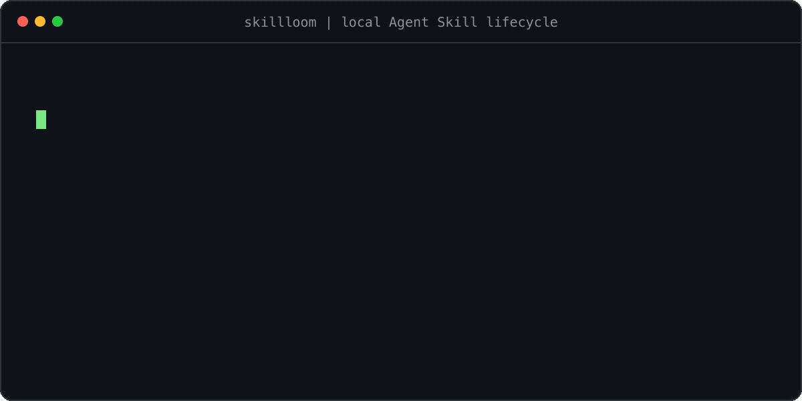

# Skillloom


Private second brain for human knowledge, agent memories, workflows, and governed portable Agent Skills across Claude Code, Codex, and every machine in your Tailnet.

[](https://www.npmjs.com/package/@chulinxz/skillloom)
[](https://github.com/Chulinuwu/skillloom/actions/workflows/ci.yml)
[](https://github.com/Chulinuwu/skillloom/actions/workflows/codeql.yml)
[](https://nodejs.org/)
[](LICENSE)



An agent solves a hard problem on one machine. A week later, another agent hits the same problem on another machine and starts from zero. The useful answer existed, but it was trapped in a session log.

Skillloom makes that knowledge durable. Agents write bounded Brain records through MCP or HTTP. People browse the same Markdown Brain in a hosted, read-only Obsidian Web UI. When a workflow proves reusable, Skillloom can turn it into an immutable skill candidate, validate it, enforce policy, and promote it transactionally into Claude Code, Codex, or another portable agent target.

Skills are part of the second brain, not the whole thing. Notes, facts, sources, decisions, project context, memories, and workflow evidence stay as knowledge. Only a validated and approved skill package becomes executable agent instruction.

## Mental model

| Layer | What it stores | Who writes | How it is trusted |
| --- | --- | --- | --- |
| Brain | Notes, facts, sources, decisions, project context, memories, and workflow evidence | Agents through authenticated tools | Revision checks, provenance, idempotency, audit |
| Workflow evidence | What worked, what failed, verifier results, and base artifact hashes | Host agent and Skillloom services | Bounded capture, secret redaction, replay-safe records |
| Skill candidates | Immutable proposed skill packages | Agent or human | Snapshot hashing, validation, scanner findings |
| Skill releases | Approved portable Agent Skills | Policy or promoter | Server-side validation, signed registry, transactional local promotion |
| Obsidian Web UI | Human browsing view over the Brain | Read-only surface | Writes stay behind authenticated Skillloom APIs |

Local-first still matters. Every machine keeps its own `.skillloom/` store for local policy, candidates, operations, backups, locks, installed targets, cached Hub state, and pending writes. The optional Hub is a private synchronization and access boundary inside your Tailnet, not a shared mutable filesystem.

## Quick start

Install the Skillloom plugin on each Claude Code or Codex machine, start a new task, and invoke `$setup-skillloom`. The plugin bundles the setup runner and MCP bridge, so the normal path does not require a global `skillloom` binary.

The setup skill asks at most one role question before setup side effects:

| Role | Choose this when | What setup handles |
| --- | --- | --- |
| Main Hub | This machine should host the private second brain | Installs local integrations, checks Docker and Tailscale, starts the loopback-only Docker stack after consent, configures private Tailscale Serve, and prints the Hub, Obsidian, and policy outputs |
| Client Node | This machine should use an existing Hub | Accepts a pasted credential-free Hub URL or discovers a Hub, asks for trust, verifies Brain read access, reconciles releases, and installs local integrations |
| This Machine Only | No shared Hub is needed | Installs local integrations and keeps all state on this machine |

If the user pastes a credential-free Hub URL, setup treats the machine as a Client Node. If the user asks for local-only, setup treats it as This Machine Only.

Setup does not ask users to paste Tailscale secrets into chat. It uses the host's authenticated Tailscale session for the default Main Hub path. If Docker, Tailscale login, HTTPS enablement, plugin trust, or tailnet policy approval is missing, setup stops at that human/admin boundary and prints the exact remaining action.

Changing Tailscale and Docker instructions age quickly, so Skillloom does not bake those steps into the plugin prompt. The setup runner collects current guidance from allowlisted official docs or installed CLI help, records source URLs or command help, fetched time, page date when available, and content hash, then prints a source-bound plan.

Default Hub surfaces after Main Hub setup:

- Hub API: `https://<hub-host>.<MagicDNSSuffix>` on Tailnet HTTPS port `443`, forwarded to `http://127.0.0.1:8787`.
- Obsidian Web UI: `https://<hub-host>.<MagicDNSSuffix>:8443` on Tailnet HTTPS port `8443`, forwarded to `http://127.0.0.1:3000`.

No Docker application port is published to the LAN or internet. Tailscale Serve owns private HTTPS access. Do not enable Funnel for the Hub.

## Obsidian access

Open the Obsidian URL printed by `$setup-skillloom` or `skillloom host status` from a device in the same Tailnet. The hosted vault is mounted read-only.

Use Obsidian to browse the Brain, graph connections, inspect sources, and read agent-maintained knowledge. Do not edit the live vault through Obsidian Desktop, network shares, Taildrive, SMB, NFS, or SSHFS yet. Those paths bypass Skillloom revision and audit checks. Agents and users should write through authenticated Skillloom MCP or HTTP tools until the external-revision adapter exists.

## How Skillloom differs from claude-mem

The projects are adjacent, not direct replacements.

| Concern | claude-mem | Skillloom |
| --- | --- | --- |
| Primary job | Automatic session memory and context continuity | Curated shared knowledge plus governed skill lifecycle |
| Capture | Hooks observe work and compress observations | Bounded Brain records and explicit or Hermes-curated learning decisions |
| Retrieval | Automatic context injection and progressive memory search | Explicit Brain search in `manual` and `policy`; bounded recall in `hermes` |
| Human surface | Purpose-built memory viewer | Read-only Obsidian Web UI over a Markdown Brain |
| Skills | Memory search can be skill-facing | Candidate, validation, policy, proof, promotion, recovery, rollback, signed registry |

Short version: claude-mem helps an agent remember what happened. Skillloom helps many agents share what is worth keeping, then safely turn proven procedures into reusable skills.

The layers may be complementary, but Skillloom does not claim tested co-installation yet. Hook ordering, duplicate capture, context injection, latency, and retention boundaries need direct integration testing before recommending both as a default stack.

## What Skillloom borrows from Obsidian-first second brains

Projects like [claude-obsidian](https://github.com/AgriciDaniel/claude-obsidian) show the useful shape: a plain Markdown vault, compounding wiki behavior, source-backed answers, cross-linking, methodology-aware organization, and ongoing knowledge hygiene.

Skillloom takes that second-brain idea and adds an agent-governance boundary:

- Human knowledge, agent memory, workflow evidence, and skills live in one conceptual Brain.
- Plain Markdown remains browsable in Obsidian.
- Agent writes go through authenticated tools so revision, provenance, idempotency, and audit stay valid.
- A Brain note never becomes executable instruction unless it passes the skill candidate lifecycle.

Skillloom does not currently claim automatic whole-vault organization, Obsidian-native authoring sync, or claude-obsidian compatibility.

## Modes

The three public modes are stable presets over four automation dimensions.

| Preset | Review trigger | Brain capture | Retrieval | Skill promotion |
| --- | --- | --- | --- | --- |
| `manual` | `manual` | `manual` | `explicit` | `manual` with `--yes` |
| `policy` | `manual` | `manual` | `explicit` | `policy` with `--policy` |
| `hermes` | `task-end` | `auto-curated` | `auto-bounded` | `policy` with `--policy` |

New stores default to `manual`. Existing v0.1 stores also load as `manual` without a destructive migration.

```bash
skillloom init
skillloom mode hermes
skillloom mode --json
```

`hermes` is the most automatic mode, but not a permissionless mode. A lifecycle-capable host can request bounded Brain recall at session start and one bounded learning decision at task end. Procedural outcomes still go through immutable candidate capture, validation, policy, quarantine on rejection, and transactional promotion on approval.

Codex and other hosts that do not expose compatible plugin lifecycle hooks still use the same Brain, skills, and MCP tools, but Hermes lifecycle behavior is invoked by the user or host instead of automatic hooks.

## Workflow-to-skill lifecycle

Declarative learning stays declarative:

```bash
skillloom observe \
  --source codex \
  --outcome memory \
  --summary "Documented the private Hub setup boundary" \
  --task-outcome success \
  --evidence run:setup-plan

skillloom journey --json
```

Reusable procedures become candidates:

```bash
skillloom capture ./draft-skill \
  --created-by agent \
  --evidence task:123 \
  --json

skillloom validate cand-20260718120000-example --json
```

Manual promotion:

```bash
skillloom promote cand-20260718120000-example \
  --target claude,codex \
  --scope project \
  --yes
```

Policy-gated promotion:

```bash
skillloom promote cand-20260718120000-example \
  --target claude,codex \
  --scope project \
  --policy
```

Do not combine `--policy` with `--yes`. Warning acceptance is manual only. Failed automatic decisions are recorded, and the candidate remains available for review instead of being deleted or installed.

## Recovery and rollback

Promotion uses staging, durable checkpoints, backups, destination hash verification, and compensation across multiple targets. A long-running operation can be inspected and resumed after interruption.

```bash
skillloom status --json
skillloom resume op-example --yes
skillloom rollback promo-example --yes
skillloom recover-lock journal --yes
```

`resume` verifies recorded staged hashes before continuing. `rollback` protects newer installed content unless `--force` is explicitly supplied after reviewing the conflict.

## Plugin installation

The plugin is the recommended installation path because it bundles the setup skill, MCP bridge, learning skills, and lifecycle integration where the host supports it. A global CLI install is optional.

Install for Claude Code from the repository root:

```bash
claude plugin marketplace add .
claude plugin install skillloom@skillloom-dev --scope local
claude plugin details skillloom@skillloom-dev
```

Install for Codex from the repository root:

```bash
codex plugin marketplace add .
codex plugin add skillloom@skillloom-dev
codex plugin list
```

After installation or update, start a new task and invoke `$setup-skillloom`.

The canonical adapters install skills to:

| Target | Project destination | User destination |
| --- | --- | --- |
| Claude Code | `<project>/.claude/skills/<skill-name>` | `~/.claude/skills/<skill-name>` |
| Codex | `<project>/.agents/skills/<skill-name>` | `~/.agents/skills/<skill-name>` |
| Agents | `<project>/.agents/skills/<skill-name>` | `~/.agents/skills/<skill-name>` |
| Generic | `<destination>/<skill-name>` | `<destination>/<skill-name>` |

## Optional CLI

Use the CLI directly when you want terminal control instead of plugin-first setup:

```bash
npm install --global @chulinxz/skillloom@0.3
skillloom init
skillloom setup --role local-only --target auto --hub local --scope user
```

Client Node with a printed or pasted Hub URL:

```bash
skillloom setup \
  --role client-node \
  --target auto \
  --hub auto \
  --hub-url https://hub-host.example.ts.net \
  --scope user
```

Main Hub as a single setup flow:

```bash
skillloom setup --role main-hub --target auto --hub auto --scope user
skillloom host status
```

Use `skillloom host install` only for advanced/manual recovery when the one-flow setup output explicitly says the host stack must be reinstalled.

## Security boundary

Skillloom protects the local lifecycle boundary. It rejects symlinks, non-regular files, binary payloads, oversized packages, undeclared executables, unsafe destinations, changed snapshots, and transaction layouts that disagree with durable checkpoints. Mode-aware package hashes cover relative paths, normalized file permissions, and content.

Skillloom does not sandbox the host agent, execute semantic analysis, embed an LLM, replace the host runtime, or claim that deterministic scanning proves behavioral quality. Obfuscated, indirect, novel, or purely natural-language instructions may evade deterministic rules. The host agent and user remain responsible for reviewing requested behavior and granting tool permissions.

Danger findings always block promotion. Manual warning overrides require both `--accept-warnings` and `--yes`. Executable resources are denied by the default automatic policy even when the package declares them. Live lock owners are never taken over because of elapsed time alone; terminate a genuinely hung owner before recovery.

Hashes created before the mode-aware format remain readable for historical rollback and recovery. Legacy candidates must be recaptured before they can receive the new permission-integrity guarantee.

## Architecture

Skillloom keeps its public trust boundaries reviewable without mixing them with operator steps or an internal implementation diary:

- [Hub topology and client synchronization](docs/architecture/hub.md)
- [Brain and governed skill lifecycle](docs/architecture/brain-and-skills.md)
- [Security and failure recovery](docs/architecture/security.md)
- [Public roadmap and explicit boundaries](docs/roadmap.md)

Deployment commands and day-two operations remain in the [Hub operator guide](hub/README.md).

## Development

Requirements are Node.js 22.16 or newer and npm. Claude Code and Codex CLIs are only required for their official plugin validators. CI runs the full lifecycle and packed global-install smoke test on Node.js 22.16, 24, and 26. CodeQL and Dependabot cover source and dependency changes.

```bash
npm ci
npm run lint
npm run typecheck
npm test
npm run build
npm run validate:plugin
npm pack
```

The manual `Publish npm package` workflow uses npm trusted publishing and `--provenance`. Configure the repository, workflow filename, and `npm` environment as a trusted publisher on npm before running it.

Validate plugin skill instructions after editing them:

```bash
python3 /path/to/skill-creator/scripts/quick_validate.py skills/autonomous-learning
python3 /path/to/skill-creator/scripts/quick_validate.py skills/capture-learning
python3 /path/to/skill-creator/scripts/quick_validate.py skills/curate-skills
python3 /path/to/skill-creator/scripts/quick_validate.py skills/setup-skillloom
```
