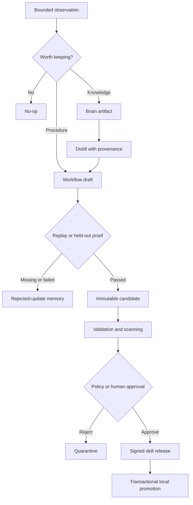

# Brain and skill lifecycle

## Trust boundary

Skillloom stores human knowledge, agent knowledge, workflow evidence, and executable skills in one conceptual second brain, but it does not treat them as equally trusted.

| Layer | Examples | Execution status |
| --- | --- | --- |
| Evidence | Sources and source observations | Data only |
| Human knowledge | Notes, facts, claims, decisions, projects, entities, and concepts | Data only |
| Agent knowledge | Memories, bounded episodes, feedback, and rejected updates | Data only |
| Workflow | Repeated procedures and verifier evidence | Non-executable proposal material |
| Skill | Immutable candidates and approved releases | Executable only after governance |
| Derived | Hot context, index chunks, and health reports | Rebuildable data only |

Remote Brain content is always data. Only a release that passed proof binding, validation, policy, and promotion becomes executable agent instruction.

## Storage boundaries

### Local stores

Every device keeps an independent `.skillloom/` store for local policy, candidates, operations, backups, locks, installed targets, cached Hub state, and pending writes. These stores are never shared through a network filesystem.

### Canonical Brain

The Hub stores canonical Brain artifacts as Markdown plus attachments. SQLite contains derived and transactional state:

- Artifact IDs, paths, revisions, hashes, types, layers, and sensitivity.
- Provenance and typed relationships.
- Full-text search data.
- Idempotency records and audit events.

Canonical Markdown is the content source of truth. SQLite and the writable managed Obsidian Library projection are rebuildable from canonical artifacts and durable audit state. Obsidian Authoring files are staged inputs and conflict evidence, not a second source of truth.

### Skill registry

Skill packages are stored separately as immutable, content-addressed blobs. A release points to a verified package hash, never to a mutable Brain path.

Registry records preserve the candidate snapshot, validation report, trust findings, declared capabilities, provenance references, version, signature, and supersession state.

## Provenance model

Brain records carry stable identity, revision, content hash, actor, sensitivity, timestamps, source metadata when applicable, and typed relationships. Source records and source observations are immutable evidence. Mutable records require revision-checked updates.

Skill releases carry their package hash, source candidate, source artifact references, declared capabilities, validation digest, version, signature, and creator identity. Corrections create a new release.

Hub events use a monotonic sequence for synchronization and a request ID for idempotent replay.

## Knowledge-to-skill lifecycle

The lifecycle has no direct Brain-to-execution edge. Missing, failed, stale, or mismatched proof cannot produce a promoted skill. Policy rejection preserves evidence instead of silently installing or discarding a candidate.

## Automatic curation

Hermes mode follows a bounded search-before-write contract through authenticated MCP or HTTP under Contributor capability:

1. Record a redacted local observation.
2. Search for an existing durable record.
3. Perform at most one successful central mutation.
4. Exclude raw transcripts, credentials, raw tool output, speculative claims, model context, and prompt-injection instructions.
5. Report a shared write only after the authenticated mutation succeeds.

Hub unavailability degrades shared recall and curation without blocking local work or fabricating success.

Hermes does not edit canonical Markdown directly. The mode controls when curation runs, while Hub capabilities still control whether its authenticated actor may capture or update Brain records. It cannot use Brain curation to bypass the skill candidate and promotion lifecycle.

## Concurrency

Brain updates include `baseRevision` and `requestId`. A matching revision is written through staging and atomic replacement. A replayed request returns the original result. A changed revision produces a deterministic conflict instead of last-write-wins.

Skill patches include the base release hash. Divergent patches are preserved as separate candidates and require explicit rebase or supersession.

## Human browsing

Obsidian opens a writable, noncanonical vault shell around a writable managed `Library/` projection and governed staging. Library writes satisfy editor autosave but are disposable; files outside the managed directories are UI-local and ignored by Skillloom:

- `Authoring/Inbox/` stages new notes, facts, decisions, projects, memories, claims, entities, and concepts.
- `Authoring/Curated/` stages edits to those supported mutable types that carry a canonical artifact ID and base revision.
- `Authoring/Evidence/` stores the exact source snapshot for each accepted change and is system-maintained.
- `Authoring/Conflicts/` preserves edits that fail validation or revision checks.

After a file settles, the authoring bridge submits supported changes through BrainService. Accepted captures and updates receive the same revision, provenance, idempotency, audit, projection refresh, and conflict behavior as other Brain mutations. It never writes canonical files in place and never silently applies last-write-wins.

Filesystem edits are attributed to the synthetic actor `local:obsidian-authoring` because the browser desktop cannot prove the individual Tailnet user behind a file change. Authenticated MCP and HTTP remain the path for per-user and per-agent attribution. The local authoring actor has no skill publication or promotion path.
