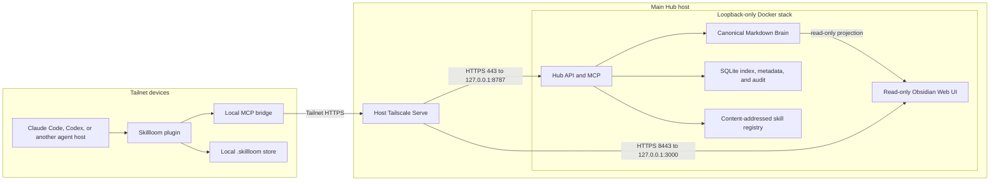

# Skillloom Hub architecture

- Status: Implemented baseline
- Scope: Private second brain and governed Agent Skills across devices in one Tailnet

## Overview

Skillloom remains one installable plugin and CLI. An optional Skillloom Hub runs in Docker on one machine. Docker application ports bind only to host loopback, and the host's authenticated Tailscale session exposes private HTTPS through Tailscale Serve.

The Hub contains two related domains:

- Brain: mutable human knowledge, agent memories, workflow evidence, notes, facts, decisions, research, sources, and attachments.
- Skill registry: immutable, validated, versioned Agent Skill releases.

A Brain artifact never becomes executable agent instruction without passing through candidate capture, validation, policy, and promotion.

Related documents:

- [Brain and skill lifecycle](brain-and-skills.md)
- [Security and recovery](security.md)
- [Operator guide](../../hub/README.md)
- [Public roadmap](../roadmap.md)

## Product contract

The plugin-first setup asks at most one role question:

| Role | Result |
| --- | --- |
| Main Hub | Installs local integrations, verifies Docker and host Tailscale, starts the loopback-only stack after consent, configures private Tailscale Serve, and prints Hub and Obsidian URLs |
| Client Node | Verifies a pasted or discovered credential-free Hub URL, checks Brain access, reconciles releases, and installs local integrations |
| This Machine Only | Installs local integrations and keeps all state on the current machine |

Main Hub setup is one flow. `skillloom host install` is an advanced recovery command, not a required second setup step.

Plugin-first does not mean permissionless. Docker privileges, Tailscale login, HTTPS enablement, plugin trust, and tailnet policy approval remain explicit human or administrator decisions.

## System topology



## Components

### Plugin

The plugin is the user-facing installation unit. It bundles:

- Brain capture, retrieval, curation, validation, promotion, recovery, and rollback skills.
- MCP configuration that starts the local bridge over stdio.
- Setup instructions and lifecycle hooks for supported hosts.
- A dispatcher for approved remote skill releases.

The plugin can start the local Docker stack after consent. It does not create Tailscale credentials, enable Funnel, or silently mutate tailnet policy.

### Local bridge

The bundled MCP configuration starts `skillloom bridge --stdio`. The bridge owns:

- Hub endpoint verification and cached trust.
- Protocol negotiation.
- MCP tool forwarding.
- Release signature verification.
- Local checkpoints, pending writes, and offline behavior.

It does not own candidate validation or local installation transactions. Those remain in Skillloom domain services.

### Hub

The Hub is the networked control plane. It owns:

- Brain reads, writes, indexing, revision checks, and audit events.
- Tailscale-derived identity plus application authorization.
- Immutable candidate uploads and signed release artifacts.
- Server-side validation, idempotency, and conflict responses.

The backend listens on `127.0.0.1:8787`. It is not published to the LAN or internet.

### Obsidian

Obsidian is an optional human browsing surface. It is not an authorization or promotion boundary.

- The browser surface listens on `127.0.0.1:3000`.
- Tailscale Serve exposes it privately on HTTPS port `8443`.
- The generated Brain projection is mounted read-only.
- Direct SMB, NFS, SSHFS, Taildrive, or native Obsidian writes to the live projection are unsupported.

Agent and human mutations go through authenticated Skillloom APIs until an audited external-revision adapter exists.

## Discovery and trust

The bridge resolves the Hub in this order:

1. A credential-free Hub URL supplied during setup.
2. A previously verified endpoint in local client state.
3. The Main Hub MagicDNS identity recorded during setup.
4. An explicitly configured advanced Tailscale Service.
5. Local-only degraded behavior.

Cached trust includes the endpoint, Hub instance ID, protocol version, and release-signing public key. A changed Hub instance or signing key requires explicit re-trust.

The default path never requires a Tailscale API key or reusable auth key. The host must already be authenticated to the intended Tailnet.

## Client synchronization

Before Client Node setup reports success, Skillloom:

1. Verifies Tailscale connectivity and the private Hub endpoint.
2. Negotiates the Hub protocol version.
3. Pins Hub identity and the release-signing public key.
4. Pulls the authorized stable release manifest.
5. Downloads missing packages into staging.
6. Verifies package hashes and signatures.
7. Promotes allowed releases transactionally.
8. Installs local integrations.
9. Runs a Brain read check and local skill status check.

At later session starts, reconciliation uses the last Hub event sequence and downloads only changed manifests and missing blobs.

If the Hub is unavailable, installed skills continue to work. Local operations continue in `.skillloom/`, and pending shared writes retain their idempotency keys for retry.

## Protocol contract

Bridge and Hub negotiation includes:

```text
protocolVersion
minimumClientVersion
hubInstanceId
tailnetIdentity
grantedCapabilities
releaseSigningPublicKey
latestEventSequence
```

Additive fields are backward-compatible. Removed or reinterpreted fields require a protocol major version. Clients reject an incompatible Hub major version. Mutations use request IDs and idempotency keys, and downloads verify content hashes.

The current reader and reconciliation path exposes signed `stable` releases only. A client may narrow automatic installation but cannot broaden Hub authorization or local policy.

## Deployment

The maintained Docker stack and operational commands live in the [Hub operator guide](../../hub/README.md). Persistent volumes contain the Brain, registry, SQLite state, staging, backups, keys, and Obsidian configuration. Docker ports remain loopback-only; host Tailscale Serve is the private network entry point.
